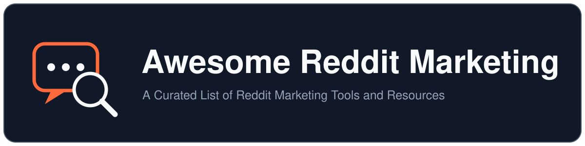

  

<h1 align="center">Awesome Reddit Marketing</h1>

  
  

  <b>A Curated List of Reddit Marketing Tools and Resources</b>

This is an unofficial, community-maintained list. It is not affiliated with, endorsed by, or sponsored by Reddit, Inc.

## Contents

- [Market and Customer Research](#market-and-customer-research)
- [Social Listening and Monitoring](#social-listening-and-monitoring)
- [Publishing and Scheduling](#publishing-and-scheduling)
- [Enterprise Social Listening](#enterprise-social-listening)
- [Opportunity Discovery](#opportunity-discovery)
- [Subreddit Discovery and Analytics](#subreddit-discovery-and-analytics)
- [Developer Tools, APIs, and Datasets](#developer-tools-apis-and-datasets)
- [Guides and Case Studies](#guides-and-case-studies)
- [FAQ](#faq)

## Market and Customer Research

*Workflows that synthesize Reddit discussions into market or customer insight.*

- [`/last30days`](https://github.com/mvanhorn/last30days-skill) - An open-source agent skill that researches recent discussion across Reddit and other public sources, then synthesizes findings for a topic.

## Social Listening and Monitoring

*Recurring keyword, brand, or competitor monitoring and alerts.*

- [F5Bot](https://f5bot.com) - A hosted keyword-alert service for Reddit, Hacker News, and Lobsters.
- [Syften](https://syften.com) - Keyword and AI-filtered monitoring across Reddit and other communities with Slack, RSS, webhook, API, and MCP delivery.
- [RedditAlert](https://www.redditalert.com) - Reddit post and comment monitoring with natural-language, regular-expression, and Boolean matching, plus drafts that users review and post themselves.
- [RedditMentions](https://redditmentions.com) - Reddit keyword monitoring for selected communities with negative keywords, email digests, and Slack alerts.
- [Harken](https://github.com/VladUZH/harken) - A self-hosted brand-monitoring service for Reddit and other public communities with local storage and optional LLM-assisted sentiment analysis.
- [KWatch.io](https://kwatch.io) - Real-time keyword and conversation monitoring across Reddit and other platforms with AI sentiment analysis and Slack, email, webhook, API, and MCP delivery.
- [Awario](https://awario.com/reddit-monitoring/) - Social listening that tracks Reddit mentions of brands and keywords with sentiment analysis, Boolean queries, backlink detection, and Slack or email alerts.
- [OpenMagpie](https://github.com/obris-dev/openmagpie) - A self-hosted social-listening tool that scores new posts from Reddit, X, YouTube, Hacker News, and RSS feeds against a natural-language relevance description using a locally run LLM.
- [Reddit Pro](https://www.business.reddit.com/pro) - Reddit's official business tool for tracking keyword and conversation trends, managing a business profile, and measuring performance.
- [Brand24](https://brand24.com) - An AI-powered social listening tool that tracks Reddit mentions and keywords with sentiment analysis and real-time alerts.
- [Octolens](https://octolens.com/reddit-monitoring) - Monitors Reddit posts and comments, scores mentions for relevance, sentiment, and intent, and delivers them through Slack, email, webhooks, API, and MCP.

## Publishing and Scheduling

*Scheduling, queuing, and timing tools for planning your own Reddit posts.*

- [Postpone](https://www.postpone.app) - A Reddit post scheduler with a content calendar, per-subreddit timing recommendations, engagement analytics, and subreddit discovery.
- [Later for Reddit](https://laterforreddit.com) - A Reddit post scheduler that analyzes each subreddit's top posting times, with crossposting, multiple accounts, and bulk CSV uploads.

## Enterprise Social Listening

*Enterprise listening and social media management suites with Reddit coverage.*

- [Brandwatch](https://www.brandwatch.com) - An enterprise consumer research and social listening suite that ingests Reddit data for brand, audience, and trend analysis.
- [Sprout Social](https://sproutsocial.com) - A social media management platform whose Reddit partnership supports listening insights, Smart Inbox engagement with brand-owned subreddits, and publishing to brand profiles.
- [Meltwater](https://www.meltwater.com) - A media intelligence and social listening suite that monitors Reddit conversations under a direct data partnership with Reddit.
- [Hootsuite](https://www.hootsuite.com) - A social media management platform whose listening tools monitor mentions across active subreddits alongside other networks.

## Opportunity Discovery

*Buying-intent detection, qualification, prioritization, and human-reviewed reply drafting.*

- [RedShip](https://redship.io) - Monitors Reddit posts and comments for keywords and competitor-switching signals, then scores opportunities and sends alerts.
- [Leaddit](https://leaddit.co) - Scans Reddit for buyer-intent discussions, assigns explainable opportunity scores, and prepares replies for users to edit and post.
- [IntentLoom](https://intentloom.com) - Finds and scores Reddit buying-intent conversations and prepares editable reply drafts for human review.
- [RedSignal](https://github.com/ivucicev/redsignal) - A self-hosted Reddit lead-monitoring pipeline with keyword matching, optional AI filtering, alerts, review stages, and reply drafts.
- [subscope](https://github.com/dancolta/subscope) - A read-only Claude Code plugin that ranks buyer-signal and authority-building threads from public Reddit feeds.
- [ThreadScout](https://github.com/mplacona/ThreadScout) - An open-source tool that scores Reddit opportunities, summarizes community rules, and drafts two reply variants without posting them.
- [ParseStream](https://parsestream.com) - Monitors Reddit, Quora, LinkedIn, X, and Hacker News for keyword matches, tags buying intent with AI, and drafts replies for the user to review and post.
- [Subreddit Signals](https://www.subredditsignals.com) - Monitors selected subreddits, ranks conversations by product fit and buyer intent, and prepares reply drafts for users to review and post.
- [Reddix](https://reddix.info) - Scans Reddit for buyer-intent conversations, scores leads, discovers relevant subreddits, and drafts context-aware replies for users to edit and post.
- [ReddMatch](https://reddmatch.com) - Matches public Reddit conversations to a product's context and provides intent, pain, and reply-strategy context for users to review before engaging.
- [SubSignal](https://www.subsignal.ai) - Monitors Reddit for brand mentions and buyer-intent conversations with sentiment analysis, lead scoring, real-time alerts, subreddit intelligence, and optional DM automation.

## Subreddit Discovery and Analytics

*Finding communities and understanding activity, timing, and related subreddits.*

- [Subreddit Traffic](https://subreddittraffic.live) - Analyzes subreddit activity, subscriber growth, posting times, and related communities.
- [PostWatch](https://www.postwatch.app) - Analyzes subreddit activity to show posting heatmaps, recommended time windows, and content performance patterns.

## Developer Tools, APIs, and Datasets

*API clients, read-oriented MCP servers, webhook relays, and research datasets.*

- [PRAW](https://praw.readthedocs.io) - A maintained synchronous Python client for Reddit's official API; [Async PRAW](https://asyncpraw.readthedocs.io) provides the asyncio interface.
- [Arctic Shift](https://arctic-shift.photon-reddit.com/search) - A free, community-run search tool, API, and downloadable dataset service for historical Reddit research.
- [Reddit MCP Buddy](https://github.com/karanb192/reddit-mcp-buddy) - A read-oriented MCP server for browsing subreddits, searching Reddit, and analyzing public user activity.
- [ThreadSnoop](https://threadsnoop.com) - A read-only Reddit API and remote MCP service for posts, comment trees, community rules, and public user context.
- [Reddwire](https://reddwire.dev) - A self-hostable Reddit-to-webhook service with signed payloads and an n8n community integration.
- [PushshiftDumps](https://github.com/Watchful1/PushshiftDumps) - Python scripts for decompressing, iterating, and filtering the historical Pushshift Reddit dump files distributed through Academic Torrents.
- [ScrapeBadger](https://scrapebadger.com/reddit-scraper) - Provides structured Reddit endpoints for searching posts, comments, subreddits, users, and related public data through REST APIs and SDKs.
- [FetchLayer](https://fetchlayer.dev/reddit-scraper) - Provides structured Reddit data through REST APIs and an MCP server for searching, scraping posts and comments, and looking up subreddits and users.

## Guides and Case Studies

*Substantive methods and engineering accounts, not promotional articles.*

- [How F5Bot slurps all of Reddit](https://intoli.com/blog/f5bot/) - An engineering account of building complete-coverage Reddit ingestion and high-volume keyword matching on a single server.

## Related Lists

*Adjacent maintained collections that add useful coverage.*

- [Awesome AI Lead Generation](https://github.com/toofast1/awesome-ai-lead-generation) - A broader collection covering intent data, social listening, enrichment, and outreach tools beyond Reddit.

## FAQ

### Are commercial products allowed

Yes. A resource can be open source, free, or commercial if its relevant capabilities are public and verifiable.

### Can maintainers submit their own products

Yes. Self-submissions must disclose the relationship and meet the same editorial standard as every other entry.

### Why are some popular Reddit tools missing

This list is still growing. We prioritize active, widely used Reddit marketing products and welcome suggestions for tools we may have missed.

### How should people use these tools safely

Readers remain responsible for Reddit's current policies and each community's rules. The list describes public capabilities; inclusion is not an endorsement of every possible use.

## Contributing

Contributions are welcome. The bar is that a resource is real and inspectable: publicly verifiable, directly relevant to Reddit marketing or research, and described in one factual sentence. See [CONTRIBUTING.md](CONTRIBUTING.md) for the entry format, inclusion rules, and pull-request checklist.

The list content in this repository is dedicated to the public domain under [CC0 1.0 Universal](LICENSE). Linked resources remain under their own licenses and terms.
